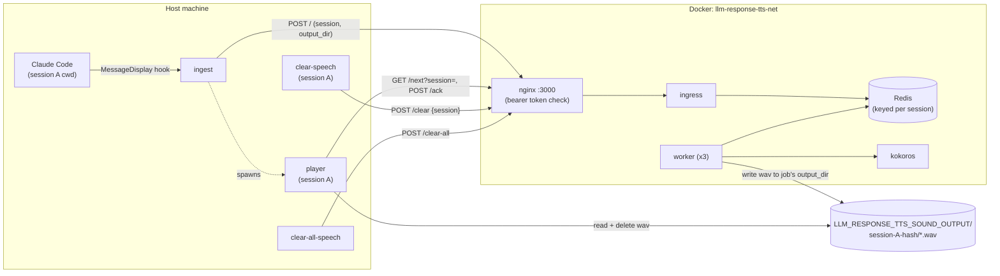
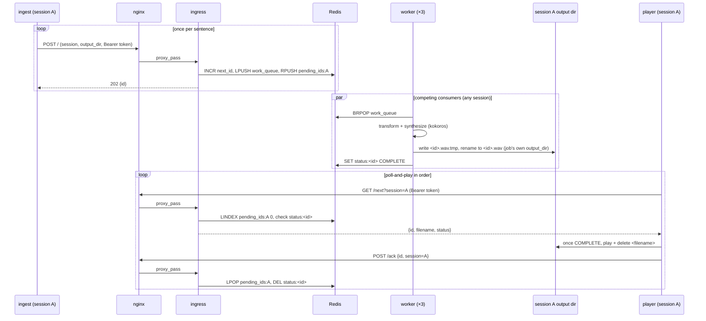

# text-to-speech

Speaks Claude Code's responses out loud using [kokoros](https://github.com/lucasjinreal/kokoros) (a Rust
implementation of Kokoro TTS), served locally in Docker, via a `MessageDisplay` hook.

## How to install

Install via Homebrew if you don't already have them:

```bash
brew install rust
brew install --cask docker
```

- **rust** - provides `cargo`, which builds all four host binaries (`llm-response-tts-ingest`,
  `llm-response-tts-clear-speech`, `llm-response-tts-clear-all-speech`, `llm-response-tts-player`) from the
  `host/` Cargo workspace. Audio playback is via the `rodio` crate, so no external player binary like
  `ffplay` is needed.
- **Docker** (with Compose) - runs the kokoros TTS server plus Redis and the queue/worker services. See
  `docker-compose.yml`. `brew install --cask docker` installs Docker Desktop, which bundles Compose; open
  it once after installing so its background daemon is running before step 2 below.

Run `./setup.sh` to do all of the below in one shot - installs rust via Homebrew if missing, creates
`docker/.env` if missing, installs all four host binaries via `cargo install`, makes sure `~/.cargo/bin`
is actually on `PATH` (Homebrew's `rust` formula doesn't add it there the way `rustup` would), builds and
starts the Docker stack, and verifies it actually responds to a real enqueue request before declaring
success. If nginx was already running from a previous `setup.sh` run and ends up holding a stale connection
to a container that just got rebuilt, the verification step recreates nginx and retries once rather than
silently leaving you with a stack that looks up but doesn't actually work. Safe to re-run after a
`git pull` to rebuild everything; it won't touch an existing `docker/.env`. The steps below are what it's
doing, for anyone who wants to run or customize them individually.

1. Create `docker/.env` with a bearer token used to authenticate requests to the TTS server:

   ```bash
   echo "LLM_RESPONSE_TTS_BEARER_TOKEN=$(openssl rand -hex 32)" > docker/.env
   ```

2. Start the stack (builds native images for kokoros, `ingress`, and `worker` on first run):

   ```bash
   docker compose up -d --build
   ```

3. Install the host-side Rust binaries (rebuild after editing the source or upgrading rustc/cargo). `host/`
   is a Cargo workspace with two members: `tools` (package `llm-response-tts-tools`, zero third-party
   dependencies - builds `ingest`, `clear-speech`, and `clear-all-speech`, sharing
   `host/tools/src/common.rs`) and `player` (package `llm-response-tts-player`, real dependencies). Both are
   installed via `cargo install`, which
   always lands in `~/.cargo/bin` - a fixed, global location, so the hook (step 4) can reference a binary by
   name alone rather than a path tied to this specific checkout:

   ```bash
   cargo install --path host/tools --force
   cargo install --path host/player --force
   ```

   This matters even more for `player`: it must run from the boot volume. If this repo lives on a non-boot
   volume (e.g. an external or secondary drive, as `/Volumes/...` paths do on macOS), the OS kills
   CoreAudio-linked binaries (`player` links `cpal` for audio output) executed from that volume with
   `SIGKILL (Code Signature Invalid)` - a restriction that doesn't apply to `ingest`, `clear-speech`, or
   `clear-all-speech`, none of which has such a dependency, but `cargo install` sidesteps it for all four
   either way since `~/.cargo/bin` is always on the boot volume. See "What it installs" below for the full
   picture.

4. Wire the hook in `.claude/settings.json` (project-level, already included in this repo):

   ```json
   {
     "hooks": {
       "MessageDisplay": [
         {
           "matcher": "",
           "hooks": [
             {
               "type": "command",
               "command": "llm-response-tts-ingest"
             }
           ]
         }
       ]
     }
   }
   ```

   This references the binary by name alone rather than a path into this checkout, so it works regardless
   of where the repo lives - as long as `~/.cargo/bin` is on `PATH` (step 3's `setup.sh` run checks this and
   fixes it if needed; if you skip `setup.sh`, make sure of it yourself, or the hook will silently do
   nothing).

   You're not limited to enabling this in the `llm-response-tts` repo itself - copy the same hook config
   into any other project's `.claude/settings.json` (or into `~/.claude/settings.json` to enable it for
   every project) to have Claude's responses spoken aloud while you work there too. `ingest` and `player`
   both locate *this* repo's `docker/.env` and `tmp/` at compile time (see "What it installs" below), not
   from Claude Code's current working directory, so they resolve correctly no matter which project the
   hook actually fires from.

5. Open Claude Code in this project directory. On first run it will prompt you to trust the project's
   `.claude/settings.json` since hooks execute arbitrary shell commands - approve it.

6. Talk to Claude normally; responses should now play back as audio.

### Customizing

- **Voice**: change the `KOKOROS_VOICE` environment variable on the `worker` service in
  `docker-compose.yml` to any voice supported by kokoros (e.g. `af_sky`, `af_bella`, `bm_daniel`,
  `bm_george`), then `docker compose up -d` to pick it up (no rebuild needed - it's an env var, not baked
  into the image). See "Env variables" below for the full list of knobs.
- **Server URL/port**: if you change the host port mapping in `docker-compose.yml`'s `nginx` service,
  update the hardcoded `127.0.0.1:3000` in `host/tools/src/bin/ingest.rs`'s `post_text` function and
  `host/player/src/main.rs`'s `BASE_URL`, then recompile both (see step 3 above).

## What it installs

**Four host binaries**, built from the `host/` Cargo workspace and run directly on your machine (not in
Docker):

- `ingest` (`host/tools/src/bin/ingest.rs`, installed as `llm-response-tts-ingest`) - the `MessageDisplay`
  hook entrypoint.
- `clear-speech` (`host/tools/src/bin/clear-speech.rs`, installed as `llm-response-tts-clear-speech`) -
  drops everything queued for the calling session (see "Session isolation" below).
- `clear-all-speech` (`host/tools/src/bin/clear-all-speech.rs`, installed as
  `llm-response-tts-clear-all-speech`) - drops everything queued across every session.
- `player` (`host/player/src/main.rs`, installed as `llm-response-tts-player`) - plays back one session's
  synthesized wav files in order.

`ingest`, `clear-speech`, and `clear-all-speech` live in the `tools` package (zero third-party dependencies,
share `host/tools/src/common.rs` via `lib.rs`). `player` is its own package (`rodio` for playback, `ureq`
for HTTP) because it needs its own install path: all four are named `llm-response-tts-*` rather than their
bare role names since `~/.cargo/bin` is a global directory shared with every other cargo tool on the machine
- same reasoning as the `llm-response-tts-*` container names below.

All four are meant to be invoked from *any* project's directory, not just this repo's own (`ingest` from the
`MessageDisplay` hook, the rest by hand) - so none of them can rely on Claude Code's current working
directory, or on where the installed binary file itself happens to sit (`~/.cargo/bin` is a fixed location
shared by every cargo tool on the machine). Instead, `ingest`, `clear-speech`, and `clear-all-speech`
(`host/tools/src/common.rs::script_dir()`) and `player` (its own copy in `main.rs`) each bake this repo's
location into the binary at **compile time**, via Rust's `env!("CARGO_MANIFEST_DIR")` - the directory
containing that crate's own `Cargo.toml` at the moment `cargo install` builds it. That's how they always
find *this* repo's `docker/.env` and `tmp/` correctly regardless of which project's cwd the hook actually
fires from. Re-run `cargo install` (step 3 above) after moving the repo to a new location, so the baked-in
path gets updated.

`ingest` always spawns `player` from `$CARGO_HOME/bin/llm-response-tts-player` (falling back to
`~/.cargo/bin` if `CARGO_HOME` isn't set) - there's no separate dev-build path or override env var. When
iterating on `player`'s source, `cargo install --path host/player --force` (step 3 above) is how you pick up
the change; `~/.cargo/bin` is always on the boot volume regardless of where this repo lives, so the
CoreAudio SIGKILL restriction mentioned in step 3 never applies to it.

**Five Docker services**, built into images and run via `docker-compose.yml`:

- `kokoros` - the Kokoro-82M TTS model, served over an OpenAI-compatible `/v1/audio/speech` API.
- `redis` - the work queue and ordering state.
- `ingress` (`services/ingress/`) - assigns each sentence its ordering id and pushes it onto the Redis work
  queue.
- `worker` (`services/worker/`, ×3 replicas) - transforms and synthesizes text.
- `nginx` - the only container with a host-published port; enforces the bearer-token check in front of
  everything else.

Neither `ingress` nor `worker` runs on the host directly. `docker/` holds their supporting config: nginx's
config template and bearer-token startup check, plus the gitignored `.env` holding the bearer token itself.

**Runtime state created on disk:**

- `tmp/` (repo-local, gitignored) - message buffers and the last-message dedupe marker. Safe to delete at
  any time while idle.
- `LLM_RESPONSE_TTS_SOUND_OUTPUT` (defaults to `/tmp/llm-response-tts/output`, outside the repo) - parent
  directory for synthesized `.wav` files. Each calling session gets its own subdirectory under here
  (`<session-hash>-<cwd-last-component>/`), written by `worker` and consumed by that session's own `player`.
  See "Architecture" below for why this lives outside the repo instead of under `tmp/`, and "Session
  isolation" for why it's split per session.
- `/tmp/llm-response-tts/lock/<session-hash>-<cwd-last-component>.lock` - one lock directory per session
  (containing a `pid` file), held by that session's running `player` for as long as it's alive. All
  sessions' locks live together here so `ls /tmp/llm-response-tts/lock` shows every session with a
  live-or-stale lock at a glance. Always under `/tmp/llm-response-tts` directly, regardless of where
  `LLM_RESPONSE_TTS_SOUND_OUTPUT` points, so lock locations stay predictable even if that env var is
  reconfigured.

## Env variables

| Name | What it represents | Default |
| --- | --- | --- |
| `LLM_RESPONSE_TTS_BEARER_TOKEN` | Shared secret nginx requires on every request (`Authorization: Bearer <token>`); read from `docker/.env` by `ingest`, `clear-speech`, `clear-all-speech`, and `player` | none - generated into `docker/.env` by `setup.sh` (`openssl rand -hex 32`); nginx refuses to start without it |
| `LLM_RESPONSE_TTS_SOUND_OUTPUT` | Parent directory for synthesized wav files; a fixed system path (not repo-relative) so `worker` and `player` agree without coordination. Each session writes/reads under its own `<session-hash>-<name>/` subdirectory of this path - see "Session isolation" | `/tmp/llm-response-tts/output` |
| `CARGO_HOME` | Not project-specific - cargo's own install root. `ingest` reads it to find where `player` was installed (`$CARGO_HOME/bin/llm-response-tts-player`) | `~/.cargo` (cargo's own default when unset) |
| `REDIS_URL` | Redis connection string, used by `ingress` and `worker` | `redis://redis:6379` |
| `KOKOROS_URL` | kokoros TTS server URL, used by `worker` | `http://kokoros:3000` |
| `KOKOROS_VOICE` | Voice model used for synthesis | `af_heart` |
| `WORD_REFS_PATH` | Path *inside the worker container* to the word-reference substitutions JSON | `/app/word-references.json` |
| `STRIP_CHARS_PATH` | Path *inside the worker container* to the strip-characters JSON | `/app/strip-characters.json` |
| `UNITS_PATH` | Path *inside the worker container* to the measurement-units JSON | `/app/measurement-units.json` |

## Architecture

- `ingest` receives streamed message deltas from the hook and buffers them per `message_id`. Once the final
  delta arrives, it splits the full text into sentences (on `.`/`!`/`?`/`:`, only when followed by
  whitespace or end of text, so decimals and no-space abbreviations stay intact) and POSTs each one
  separately to nginx (`127.0.0.1:3000`, with the bearer token), which forwards it to the `ingress` service
  - so a long message becomes several small jobs instead of one big one. It also dedupes on
  `tmp/ingest-last-message.txt` so the same message isn't spoken twice. Each POST also carries the calling
  session's hash and output directory (see "Session isolation" below).
- `ingress` assigns each sentence its own monotonically increasing id (via Redis `INCR`, shared globally
  across all sessions - see "Session isolation" for why a global counter is fine) and pushes it onto a
  Redis work queue. Three `worker` containers compete for jobs off that queue in parallel, each
  transforming the text - expanding glued number+unit tokens like `24ms` or `512Mi` into spoken words
  (`services/worker/measurement-units.json`), then word references and character stripping - and
  synthesizing it via kokoros's OpenAI-compatible `/v1/audio/speech` API, then writing the result to
  `<id>.wav` in that job's own session output directory. Splitting by sentence is what lets one long message
  actually use all 3 workers concurrently, rather than one worker synthesizing the whole thing serially.
- The first `ingest` invocation for a given session to see that session's lock free spawns `player` in the
  background, which plays that session's wav files back in strict id order - never whichever one finishes
  synthesizing first - and exits after 10s of nothing left to play.
- Synthesis is entirely local - kokoros runs the Kokoro-82M model in-container and doesn't make any
  outbound network calls, so no audio or text leaves the machine. Redis, `ingress`, and the `worker`
  containers are all internal-only too (no host-published ports), same as kokoros always was.



### Session isolation

Every Claude Code session (in practice, every distinct project `cwd` the hook fires from) gets its own
queue, output directory, and `player` process, so multiple sessions open at once never mix up each other's
wav files or playback order. `ingest` and `player` each derive a `session-hash` from `cwd` - a 32-bit
MurmurHash3 of the absolute path, base62-encoded to a fixed 6 characters - deterministically and without any
coordination between them, since both are computing the same hash from the same input. That hash prefixes a
human-readable directory name (`<hash>-<cwd-last-component>`, e.g. `2wfFFn-llm-response-tts`), used for both
the output subdirectory under `LLM_RESPONSE_TTS_SOUND_OUTPUT` and the lock directory under
`/tmp/llm-response-tts`. Every Redis key that needs to stay independent per session (`pending_ids`, the
epoch counter, and the set of known session hashes) is suffixed with the bare hash. The one exception is
`next_id`, the global monotonic id counter - it stays shared across all sessions on purpose, since ids only
need to increase, not be contiguous or session-scoped, and a shared counter is simpler than one per session
for no behavioral benefit.

Full design rationale and the Redis schema table live in
`docs/superpowers/specs/2026-08-01-per-session-isolation-design.md`.

### Message queueing

Claude Code can emit several messages back-to-back - sometimes overlapping in time - and each one triggers
its own `ingest` invocation, which itself splits into multiple sentence-level jobs (see above). Either way,
synthesis happens across 3 parallel workers, so a later sentence - from the same message or a different one
- can easily finish before an earlier one; playback still has to happen in the order Claude actually
generated the text, so ordering can no longer be inferred from "whichever wav file shows up first."

The id `ingress` assigns via Redis `INCR` is the fix: each sentence gets one assigned once, atomically, at
the moment it's accepted, before any parallel processing happens, so it reflects true generation order
regardless of which worker later picks up the job or how long synthesis takes. That same id is also
pushed onto a per-session Redis list, `llm-response-tts:pending_ids:<session-hash>`, purely to track that
session's playback order - separate from `llm-response-tts:work_queue`, which is shared across all sessions
and is what the workers pull jobs from.

Ordering state lives entirely in Redis, not in a local file. `player` doesn't track "the next id" on disk
at all; it just asks `ingress` - `GET /next?session=<session-hash>` peeks the front of that session's
`pending_ids` list and returns `{"id", "filename", "status"}`, where `status` is `PROCESSING` or `COMPLETE`
depending on whether a worker has finished writing that id's wav yet (workers report completion into Redis
right after they write the file). `player` polls that endpoint every couple seconds; once it sees
`COMPLETE`, it plays the file from its session's output directory via `rodio`, deletes it, and calls
`POST /ack` (also carrying `session`) to pop that id off `pending_ids` before moving to the next one. If an
id stays `PROCESSING` for more than 45 seconds (long enough to cover normal CPU-bound synthesis time, since
Docker on macOS has no GPU passthrough - a worker that's actually crashed mid-job needs this much slack
too), it gives up, acks it anyway, and moves on - so one dead job can't stall everything behind it. With
nothing pending at all for 10 seconds, `player` exits.

Keeping this state server-side instead of in a local watermark file removes a whole category of bugs: a
local file can drift from what Redis actually has queued (e.g. if `tmp/` gets wiped while Redis keeps
counting, or Redis restarts while the local file doesn't) - `pending_ids` can't drift from itself.

Only one `player` may run per session, enforced with `mkdir /tmp/llm-response-tts/lock/<session-dir>.lock`
(see "Session isolation" above): `mkdir` is atomic at the filesystem level, so if two `ingest` invocations
for the same session race to create it, exactly one spawns that session's player; the rest just enqueue
their message and trust the already-running player to reach it in order. A different session's lock lives
under a different directory entirely, so sessions never contend with each other for it.



To stop everything queued for the current session (e.g. Claude said something long and you don't want to
hear the rest), run `llm-response-tts-clear-speech`. It calls `ingress`'s `POST /clear {session}`, which
empties that session's `pending_ids` list - so its `player` sees nothing pending on its next poll - and
bumps that session's epoch counter in Redis so any job a worker already popped and is mid-synthesis for
this session gets silently discarded instead of writing a wav nobody will ever ask for; other sessions'
queued jobs are untouched. `llm-response-tts-clear-all-speech` is the blunter version: it calls
`POST /clear-all`, which does the same for every known session at once (draining the shared `work_queue`
too), for when you want silence across the board rather than just your current project. Neither command
interrupts whatever's playing on the host right now, only what would've come after it; `player` blocks
until playback finishes before its next poll, so cutting off mid-sentence would need a different design.

## Security Audit results

Only `nginx` is bound to the host, and only on `127.0.0.1:3000` - kokoros, Redis, `ingress`, and all 3
`worker` containers publish no host port at all (`expose` only in `docker-compose.yml`), reachable
solely from other containers on the compose-internal `llm-response-tts-net` network. That's a network-layer
restriction enforced by the OS before any request-level logic runs, which is a stronger guarantee than
CORS (a browser-only convention that doesn't stop non-browser clients or even see the underlying TCP
connection). nginx also requires every request to carry `Authorization: Bearer <token>` matching
`LLM_RESPONSE_TTS_BEARER_TOKEN` from `docker/.env` (see `docker/nginx/templates/default.conf.template`,
which proxies to `ingress` instead of talking to kokoros directly), so nothing else on the machine can
enqueue a message without the token either. `ingest` and `player` both read that same `.env` file and
attach the token automatically - `ingest` to enqueue, `player` to poll `/next` and call `/ack` - and the
file is gitignored, so each machine needs its own. Once a message is past `ingress`, nothing else in the
pipeline re-checks the token - `worker` calling kokoros directly is trusted the same way nginx calling
kokoros used to be, because it's still all on the private internal network only trusted containers can
reach.

nginx is the only authentication layer in this deployment - neither kokoros nor `ingress` implements auth
of its own - so its startup is required to fail closed rather than fail open. `docker/.env` is gitignored
and therefore always local to a given machine; if it were ever missing or misconfigured, the server must
refuse to start rather than come up in a state that quietly accepts requests. Two checks enforce that:
the nginx service's `env_file` is marked `required: true`, so Compose refuses to start nginx at all if
`docker/.env` doesn't exist, and `docker/nginx/entrypoint.d/25-check-bearer-token.sh` runs as part of
nginx's own startup sequence to verify the token was actually substituted into the rendered config,
aborting startup if it wasn't.

The full run path was also audited for network egress, to confirm no data leaves the machine except the
initial model download and the Docker build. The kokoros Rust workspace has exactly one outbound network
call in its entire dependency tree - the ONNX model and voices file are fetched once from a fixed GitHub
Releases URL during the Docker build and baked into the image, not re-fetched on container start - and no
telemetry, analytics, or update-check dependencies anywhere. The same holds for `ingress` and `worker`:
`ingress` only ever talks to Redis, and `worker`'s only outbound call is to `http://kokoros:3000` on the
internal network - neither has a code path that can reach anywhere outside `llm-response-tts-net`. Note
that `docker compose up -d --build` (as used in step 2 of "How to install") touches the network on every
invocation, not just the first, since it re-clones the build context and re-pulls base images - drop
`--build` for routine restarts if you want network activity limited to true first-time setup.

Per-session isolation (see "Session isolation" under Architecture) is an organizational and UX boundary, not
a security one: it keeps concurrent Claude Code sessions' audio and queues from interfering with each other,
but every session still authenticates with the same shared `LLM_RESPONSE_TTS_BEARER_TOKEN` against the same
`ingress` instance. A session hash is derived from a directory path, not a secret, and isn't meant to be one
- anyone who can reach `ingress` (i.e. anyone with the bearer token) can address, enqueue into, or clear any
other session's queue simply by supplying its hash. That's an acceptable trade-off for a single-user local
deployment where the token itself is already the trust boundary, but it means session hashes shouldn't be
treated as access control if this is ever exposed beyond `127.0.0.1`.
