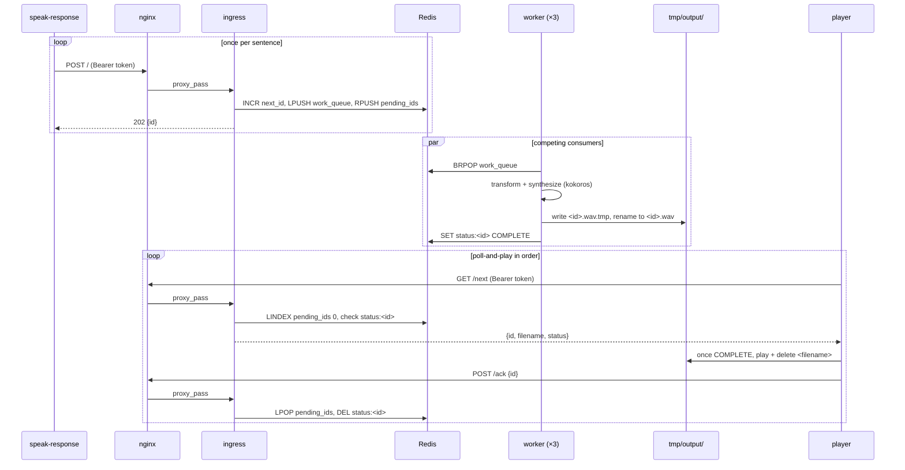

# text-to-speech

Speaks Claude Code's responses out loud using [kokoros](https://github.com/lucasjinreal/kokoros) (a Rust
implementation of Kokoro TTS), served locally in Docker, via a `MessageDisplay` hook.

## How it works

- `speak-response` (compiled from `host/tools/src/bin/speak-response.rs`) receives streamed message deltas from the hook
  and buffers them per `message_id`. Once the final delta arrives, it splits the full text into sentences
  (on `.`/`!`/`?`/`:`, only when followed by whitespace or end of text, so decimals and no-space
  abbreviations stay intact) and POSTs each one separately to nginx (`127.0.0.1:3000`, with the bearer
  token), which forwards it to the `ingress` service — so a long message becomes several small jobs instead
  of one big one.
- It also dedupes on `tmp/speak-response-last-message.txt` so the same message isn't spoken twice.
- `ingress` assigns each sentence its own monotonically increasing id (via Redis `INCR`) and pushes it onto
  a Redis work queue. Three `worker` containers compete for jobs off that queue in parallel, each
  transforming the text — expanding glued number+unit tokens like `24ms` or `512Mi` into spoken words
  (`services/worker/measurement-units.json`), then word references and character stripping, the same logic
  `word-refs.rs` used to apply — and synthesizing it via kokoros's OpenAI-compatible `/v1/audio/speech` API,
  then writing the result to `tmp/output/<id>.wav`. Splitting by sentence is what lets one long message
  actually use all 3 workers concurrently, rather than one worker synthesizing the whole thing serially.
- The first `speak-response` invocation to see an empty worker lock spawns the player binary (compiled from
  `host/player/src/main.rs`, installed via `cargo install` to `~/.cargo/bin/player` — see Setup step 3 for
  why it can't just live in this repo like `speak-response` and `clear-speech` can) in the background, which plays
  wav files back in strict id order — never whichever one finishes synthesizing first — and exits after 10s
  of nothing left to play.
- Synthesis is entirely local — kokoros runs the Kokoro-82M model in-container and doesn't make any
  outbound network calls, so no audio or text leaves the machine. Redis, `ingress`, and the `worker`
  containers are all internal-only too (no host-published ports), same as kokoros always was.

## Message queueing

Claude Code can emit several messages back-to-back — sometimes overlapping in time — and each one triggers
its own `speak-response` invocation, which itself now splits into multiple sentence-level jobs (see "How it
works" above). Either way, synthesis happens across 3 parallel workers, so a later sentence — from the same
message or a different one — can easily finish before an earlier one; playback still has to happen in the
order Claude actually generated the text, so ordering can no longer be inferred from "whichever wav file
shows up first."

The id `ingress` assigns via Redis `INCR` is the fix: each sentence gets one assigned once, atomically, at
the moment it's accepted, before any parallel processing happens, so it reflects true generation order
regardless of which worker later picks up the job or how long synthesis takes. That same id is also
pushed onto a second Redis list, `kokoros:pending_ids`, purely to track playback order — separate from
`kokoros:work_queue`, which is what the workers pull jobs from.

Ordering state lives entirely in Redis, not in a local file. The player binary doesn't track "the next id" on
disk at all; it just asks `ingress` — `GET /next` peeks the front of `pending_ids` and returns
`{"id", "filename", "status"}`, where `status` is `PROCESSING` or `COMPLETE` depending on whether a worker
has finished writing that id's wav yet (workers report completion into Redis right after they write the
file). the player binary polls that endpoint every couple seconds; once it sees `COMPLETE`, it plays the file
from `tmp/output/` via `rodio`, deletes it, and calls `POST /ack` to pop that id off `pending_ids` before
moving to the next one. If an id stays `PROCESSING` for more than 45 seconds (long enough to cover normal
CPU-bound synthesis time, since Docker on macOS has no GPU passthrough — a worker that's actually crashed
mid-job needs this much slack too), it gives up, acks it anyway, and moves on — so one dead job can't
stall everything behind it. With nothing pending at all for 10 seconds, the player binary exits.

Keeping this state server-side instead of in a local watermark file removes a whole category of bugs: a
local file can drift from what Redis actually has queued (e.g. if `tmp/` gets wiped while Redis keeps
counting, or Redis restarts while the local file doesn't) — `pending_ids` can't drift from itself.

Only one instance of the player binary may run at a time, enforced with `mkdir tmp/worker.lock` as before: `mkdir` is atomic
at the filesystem level, so if two `speak-response` invocations race to create it, exactly one spawns the
player; the rest just enqueue their message and trust the already-running player to reach it in order.



To stop everything queued (e.g. Claude said something long and you don't want to hear the rest), run `./bin/clear-speech`. It calls `ingress`'s `POST /clear`, which empties `work_queue` and `pending_ids` — so the player binary sees nothing pending on its next poll — and bumps an epoch counter in Redis so any job a worker already popped and is mid-synthesis gets silently discarded instead of writing a wav nobody will ever ask for. This doesn't interrupt whatever's playing on the host right now, only what would've come after it; the player binary blocks until playback finishes before its next poll, so cutting off mid-sentence would need a different design.

## Prerequisites

Install via Homebrew:

```bash
brew install rust
```

- **rust** — provides `cargo`, which builds all three host binaries (`speak-response`, `clear-speech`,
  `player`) from the `host/` Cargo workspace. Audio playback is via the `rodio` crate, so no external player
  binary like `ffplay` is needed.
- **Docker** (with Compose) — runs the kokoros TTS server plus Redis and the queue/worker services. See
  `docker-compose.yml`.

## Setup

Run `./setup.sh` to do all of the below in one shot — installs rust via Homebrew if missing, creates
`docker/.env` if missing, compiles the host binaries, installs `player` outside the repo, builds and starts
the Docker stack, and verifies it actually responds to a real enqueue request before declaring success. If
nginx was already running from a previous `setup.sh` run and ends up holding a stale connection to a
container that just got rebuilt, the verification step recreates nginx and retries once rather than
silently leaving you with a stack that looks up but doesn't actually work. Safe to re-run after a
`git pull` to rebuild everything; it won't touch an existing `docker/.env`. The steps below are what it's
doing, for anyone who wants to run or customize them individually.

1. Create `docker/.env` with a bearer token used to authenticate requests to the TTS server:

   ```bash
   echo "KOKOROS_BEARER_TOKEN=$(openssl rand -hex 32)" > docker/.env
   ```

2. Start the stack (builds native images for kokoros, `ingress`, and `worker` on first run):

   ```bash
   docker compose up -d --build
   ```

3. Compile the host-side Rust binaries (rebuild after editing the source or upgrading rustc/cargo). `host/`
   is a Cargo workspace with two members: `tools` (the zero-dependency `speak-response` and `clear-speech`
   binaries, sharing `host/tools/src/common.rs`) and `player` (its own crate, package name `kokoros-player`,
   with real dependencies) — one `cargo build` produces all three into a shared `host/target/`:

   ```bash
   mkdir -p bin
   cargo build --release --manifest-path host/Cargo.toml
   cp host/target/release/speak-response bin/speak-response
   cp host/target/release/clear-speech bin/clear-speech
   cargo install --path host/player --force
   ```

   `player` is installed as `kokoros-player` via `cargo install` instead of being copied into `bin/` like
   `speak-response` and `clear-speech`, because it must run from the boot volume. If this repo lives on a
   non-boot volume (e.g. an external or secondary drive, as `/Volumes/...` paths do on macOS), the OS kills
   CoreAudio-linked binaries (`player` links `cpal` for audio output) executed from that volume with
   `SIGKILL (Code Signature Invalid)` — a restriction that doesn't apply to plain binaries like
   `speak-response` and `clear-speech`, neither of which has such a dependency. `cargo install` always
   installs into `~/.cargo/bin`, which is on the boot volume, so this works regardless of where the repo
   itself lives. It's named `kokoros-player` rather than just `player` since `~/.cargo/bin` is a global
   directory shared with every other cargo tool on the machine. `speak-response` looks for it at
   `/tmp/kokoros-rust/kokoros-player` first (a dev build, see `host/player/build.sh`) and falls back to
   `~/.cargo/bin/kokoros-player`. Either way, it passes the repo's actual location to player via a
   `KOKOROS_ROOT` environment variable when it spawns it, so player still finds `tmp/`, `docker/.env`, etc.
   correctly.

4. Wire the hook in `.claude/settings.json` (project-level, already included in this repo):

   ```json
   {
     "hooks": {
       "MessageDisplay": [
         {
           "matcher": "",
           "hooks": [
             {
               "type": "command",
               "command": "$CLAUDE_PROJECT_DIR/bin/speak-response"
             }
           ]
         }
       ]
     }
   }
   ```

5. Open Claude Code in this project directory. On first run it will prompt you to trust the project's
   `.claude/settings.json` since hooks execute arbitrary shell commands — approve it.

6. Talk to Claude normally; responses should now play back as audio.

## Customizing

- **Voice**: change the `KOKOROS_VOICE` environment variable on the `worker` service in
  `docker-compose.yml` to any voice supported by kokoros (e.g. `af_sky`, `af_bella`, `bm_daniel`,
  `bm_george`), then `docker compose up -d` to pick it up (no rebuild needed — it's an env var, not baked
  into the image).
- **Server URL/port**: if you change the host port mapping in `docker-compose.yml`'s `nginx` service,
  update the hardcoded `127.0.0.1:3000` in `host/tools/src/bin/speak-response.rs`'s `post_text` function and
  `host/player/src/main.rs`'s `BASE_URL`, then recompile both (see Setup step 3).

## Security

Only `nginx` is bound to the host, and only on `127.0.0.1:3000` — kokoros, Redis, `ingress`, and all 3
`worker` containers publish no host port at all (`expose` only in `docker-compose.yml`), reachable
solely from other containers on the compose-internal `kokoros-net` network. That's a network-layer
restriction enforced by the OS before any request-level logic runs, which is a stronger guarantee than
CORS (a browser-only convention that doesn't stop non-browser clients or even see the underlying TCP
connection). nginx also requires every request to carry `Authorization: Bearer <token>` matching
`KOKOROS_BEARER_TOKEN` from `docker/.env` (see `docker/nginx/templates/default.conf.template`, which now
proxies to `ingress` instead of talking to kokoros directly), so nothing else on the machine can enqueue a
message without the token either. `speak-response` and the player binary both read that same `.env` file and
attach the token automatically — `speak-response` to enqueue, the player binary to poll `/next` and call `/ack`
— and the file is gitignored, so each machine needs its own. Once a message is past `ingress`,
nothing else in the pipeline re-checks the token — `worker` calling kokoros directly is trusted the same
way nginx calling kokoros used to be, because it's still all on the private internal network only trusted
containers can reach.

nginx is the only authentication layer in this deployment — neither kokoros nor `ingress` implements auth
of its own — so its startup is required to fail closed rather than fail open. `docker/.env` is gitignored
and therefore always local to a given machine; if it were ever missing or misconfigured, the server must
refuse to start rather than come up in a state that quietly accepts requests. Two checks enforce that:
the nginx service's `env_file` is marked `required: true`, so Compose refuses to start nginx at all if
`docker/.env` doesn't exist, and `docker/nginx/entrypoint.d/25-check-bearer-token.sh` runs as part of
nginx's own startup sequence to verify the token was actually substituted into the rendered config,
aborting startup if it wasn't.

The full run path was also audited for network egress, to confirm no data leaves the machine except the
initial model download and the Docker build. The kokoros Rust workspace has exactly one outbound network
call in its entire dependency tree — the ONNX model and voices file are fetched once from a fixed GitHub
Releases URL during the Docker build and baked into the image, not re-fetched on container start — and no
telemetry, analytics, or update-check dependencies anywhere. The same holds for `ingress` and `worker`:
`ingress` only ever talks to Redis, and `worker`'s only outbound call is to `http://kokoros:3000` on the
internal network — neither has a code path that can reach anywhere outside `kokoros-net`. Note that
`docker compose up -d --build` (as used in step 2 above) touches the network on every invocation, not just
the first, since it re-clones the build context and re-pulls base images — drop `--build` for routine
restarts if you want network activity limited to true first-time setup.

## Notes

- `tmp/` holds runtime state (buffers, last-message marker, and generated `.wav` files under
  `tmp/output/`) and is gitignored — safe to delete at any time while idle. There's no local playback
  watermark to worry about anymore; ordering lives in Redis, so a `tmp/` wipe or a `redis` restart just
  means whatever was mid-flight gets lost, not a stuck or drifted player.
