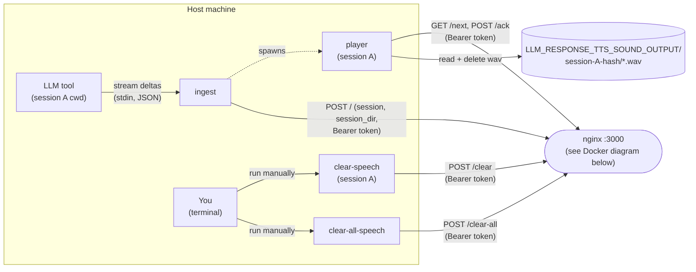
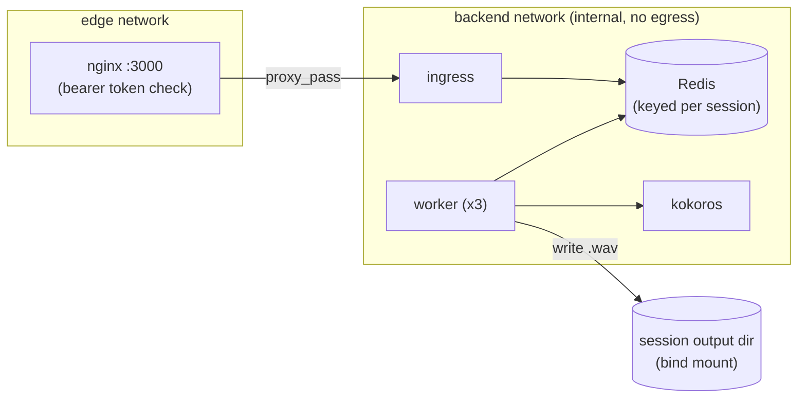
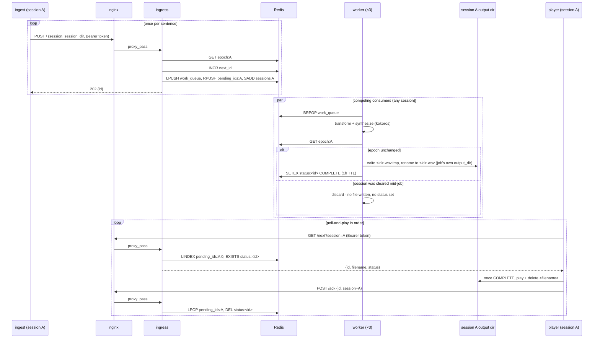

# Architecture

A response streams out of the LLM tool, gets buffered and sentence-split on the host by
`ingest`, and crosses into Docker as one authenticated HTTP request per sentence. `nginx` gates
every request behind a bearer token and forwards it to `ingress`, which queues the sentence in
Redis; a pool of `worker` containers pulls jobs off that queue, synthesizes each one through
kokoros, and writes the resulting `.wav` to a shared output directory. `player`, back on the
host, polls `ingress` for completed sentences and plays them in the order they were generated,
regardless of which worker finished first. Everything from `ingress` through kokoros stays on an
internal-only Docker network with no route to the internet - `nginx` is the sole bridge between
the host and that network, and the sole point where a request is authenticated.

## Diagrams

### Host machine

Only `ingest` is ever driven by the LLM tool. `player` is started by `ingest`, not called
directly by anything upstream of it, and the two clear tools are invoked by a human at a
terminal, not by the LLM tool.

### Docker containers

## Tools (local)

Host-side binaries, built by `cargo install` (see the main [README](../README.md)). Only
`ingest` is actually invoked by the LLM tool, via the `MessageDisplay` hook in
`.claude/settings.json` - `player` is spawned by `ingest`, not by the LLM tool directly, and
`clear-speech`/`clear-all-speech` are commands you run yourself in a terminal, not something any
LLM tool triggers.

| Tool                | Summary                                                                                                            | Communicates via                                                                                                    | Crate dependencies                             |
|---------------------|---------------------------------------------------------------------------------------------------------------------|-----------------------------------------------------------------------------------------------------------------------|-------------------------------------------------|
| `ingest`             | `MessageDisplay` hook entrypoint; buffers streamed deltas per message, splits finished text into sentences, dedupes repeat sends. | Reads JSON deltas from stdin; `POST /` to nginx per sentence (`session`, `session_dir`, Bearer token); spawns `player`. | none (hand-rolled JSON/HTTP, std only)          |
| `player`             | Per-session poll-and-play loop; plays synthesized sentences back in generation order, one instance per session.    | `GET /next` / `POST /ack` to nginx (Bearer token); reads and deletes `.wav` files from the session's output dir.      | `rodio`, `ureq`, `serde`, `serde_json`, `libc`  |
| `clear-speech`       | Drops everything queued for the calling session. Run manually.                                                     | `POST /clear` to nginx (Bearer token).                                                                                | none (hand-rolled JSON/HTTP, std only)          |
| `clear-all-speech`   | Drops everything queued across every session. Run manually.                                                        | `POST /clear-all` to nginx (Bearer token).                                                                            | none (hand-rolled JSON/HTTP, std only)          |

## Services (Docker)

Everything behind nginx. See [security-audit.md](security-audit.md) for how these are isolated
from each other and from the internet.

| Service        | Summary                                                                                                                    | Communicates via                                                                                                          |
|----------------|-------------------------------------------------------------------------------------------------------------------------------|-------------------------------------------------------------------------------------------------------------------------------|
| `nginx`        | Host-facing reverse proxy; the only container with a published port; enforces the bearer token before forwarding anything. | Listens on `127.0.0.1:3000`; proxies to `ingress` over the backend network.                                                   |
| `ingress`      | Queue API; the only write path into Redis. Validates `session_dir` against `session`, derives `output_dir` server-side, assigns sentence ids. | HTTP from nginx only; talks to Redis over the backend network.                                                                |
| `redis`        | Work queue plus per-session ordering/status state.                                                                          | TCP, backend network only; read and written by `ingress` and `worker`.                                                        |
| `worker` (×3)  | Transforms text (unit expansion, word references, character stripping) and synthesizes it via kokoros; writes the resulting `.wav`. | Pulls jobs from Redis; calls kokoros's OpenAI-compatible API over the backend network; writes to the shared output dir bind mount. |
| `kokoros`      | Runs the Kokoro-82M model in-container; the only thing that actually does text-to-speech.                                   | HTTP from `worker` only, backend network, no outbound internet access (`internal: true`).                                     |

## Rust frameworks and crates (Docker services)

Scoped to `ingress` and `worker` - the two services this repo actually builds. `redis` and
`nginx` are unmodified upstream images; kokoros is a separate audited project (see
[security-audit.md](security-audit.md)).

| Crate                              | Used by            | Purpose                                                                          |
|-------------------------------------|---------------------|-----------------------------------------------------------------------------------|
| `axum`                               | `ingress`            | HTTP web server framework - routing and request/response for all 5 endpoints.     |
| `tokio`                              | `ingress`, `worker`  | Async runtime both services run on.                                               |
| `redis`                              | `ingress`, `worker`  | Redis client - work queue, per-session ordering, status keys.                     |
| `reqwest`                            | `worker`             | HTTP client - calls kokoros's OpenAI-compatible `/v1/audio/speech` endpoint.      |
| `serde` / `serde_json`               | `ingress`, `worker`  | JSON (de)serialization for request/response bodies and queue payloads.            |
| `tracing` / `tracing-subscriber`     | `ingress`, `worker`  | Structured logging.                                                               |

## HTTP endpoints [link](endpoints.md)

`ingress`'s full HTTP surface - every enqueue, poll, ack, and clear request nginx proxies to it -
is documented separately in [endpoints.md](endpoints.md).

## Session isolation

### What is a session?

A session is one distinct project working directory (`cwd`) that the LLM tool's hook fires from.
It's not a login, a token, or anything issued by a server - it's just an identity derived
entirely from *where on disk* a request originated.

That means identity follows the directory, not the tool or the window. Two Claude Code windows
open in the same project directory are the same session. The same project opened in two
different tools (Claude Code and Codex, say) is also the same session, since both derive identity
from the same `cwd`.

A session's actual identity is a `session-hash`: a 32-bit MurmurHash3 of the absolute `cwd` path,
base62-encoded to a fixed 6 characters. That hash prefixes a human-readable directory name
(`<hash>-<cwd-last-component>`, e.g. `2wfFFn-llm-response-tts`), used anywhere a session needs a
filesystem-safe name rather than the bare hash.

### How is session used in managing requests and processing audio?

Every request `ingest`, `player`, and the `clear-*` tools send to `ingress` carries the session
hash (see [HTTP endpoints](endpoints.md)). `ingress` uses that hash to namespace state in Redis:
each session gets its own playback-order list and its own epoch counter (see
[Message queueing](#message-queueing)), so one session's queue, ordering, and clear operations
never touch another's.

The one exception is the global monotonic id counter used to assign playback order. It stays
shared across all sessions on purpose, since ids only need to increase, not be contiguous or
session-scoped - a shared counter is simpler than one per session for no behavioral benefit.

The human-readable `session_dir` is what ties a session to where its audio actually lives on
disk. `ingress` validates it against the session hash on enqueue (see
[security-audit.md](security-audit.md#server-side-output_dir-derivation)) before using it to
build that job's output directory. That's what lets `worker` write each `.wav` under the correct
session's own subdirectory of `LLM_RESPONSE_TTS_SOUND_OUTPUT`, and what keeps `player` reading
and deleting files only from its own session's directory.

### Player lock

Only one `player` process may run per session at a time - that's what keeps a session's audio
playing in one strict order instead of two players racing to read from the same directory.

`player` enforces this itself on startup with an atomic lock scoped to that session's own path. If
two `ingest` invocations for the same session each try to spawn a player, only one acquires the
lock; the other's spawn attempt just exits immediately, and the already-running player keeps
handling that session's queue.

Because the lock path is derived from the session hash, a different session's lock always lives
somewhere else entirely - sessions never contend with each other for it.

Session identity is a routing and isolation mechanism, not an access-control one - see
[security-audit.md](security-audit.md#session-isolation-is-ux-not-access-control) for what that
does and doesn't protect against.

## Message queueing

### Why a queue with workers running in parallel?

An LLM tool can emit several messages back-to-back - sometimes overlapping in time - and `ingest`
splits each one into several sentence-level jobs on top of that (see [Tools
(local)](#tools-local)). A single long response can easily produce a dozen small jobs in quick
succession, and synthesizing them one at a time, serially, would mean the first sentence isn't
heard until the whole response has been spoken through one worker.

A queue backed by a pool of workers fixes that: any of the 3 workers can pick up any pending job,
so a burst of sentences gets synthesized concurrently instead of queued behind each other. That's
what keeps playback starting quickly even for a long response.

Running things in parallel introduces its own problem, though - a later sentence can easily
finish synthesizing before an earlier one, since synthesis time varies per job. Playback still
has to happen in the order the text was actually generated, so ordering can no longer be inferred
from "whichever file finishes first." The rest of this section is mostly about how that ordering
is preserved despite the parallelism.

### Why Redis?

The queue and the ordering state both need to be visible to multiple independent containers -
`ingress` and 3 replicas of `worker` - which rules out anything held in one process's memory or
in a local file. Redis is shared, network-reachable state that all of them can reach over the
internal Docker network, with exactly the primitives this problem needs: atomic counters
(`INCR`) for handing out ids without a race, blocking list pops (`BRPOP`) so idle workers don't
have to busy-poll for work, and cheap per-session keys for isolating one session's ordering from
another's (see [Session isolation](#session-isolation)). It's also already the natural home for
this kind of ephemeral, fast-changing coordination state - nothing here needs to survive a Redis
restart, so a lighter-weight in-memory store was a better fit than reusing a persistent database
for it.

### Key shapes in Redis

| Key                                        | Type              | Represents                                                                                                   |
|---------------------------------------------|-------------------|------------------------------------------------------------------------------------------------------------------|
| `llm-response-tts:next_id`                   | String (counter)  | The global monotonic id counter. Shared across all sessions - see [Session isolation](#session-isolation) for why. |
| `llm-response-tts:work_queue`                | List              | The shared job queue. Every enqueued sentence lands here; any worker, from any session, can pop the next one.     |
| `llm-response-tts:pending_ids:<session-hash>`| List              | One session's ordered list of ids still awaiting playback. Defines that session's playback order.               |
| `llm-response-tts:epoch:<session-hash>`      | String (counter)  | One session's "generation" number. Bumped on clear so any job a worker already popped for that session gets silently discarded instead of writing audio nobody will hear. |
| `llm-response-tts:status:<id>`               | String (1h TTL)   | Marks that a job's audio has finished synthesizing - its existence means `COMPLETE`. Expires on its own so a completed-but-never-acked job doesn't linger forever. |
| `llm-response-tts:sessions`                  | Set               | Every session hash that has ever enqueued a job, so `clear-all` knows which sessions to sweep.                    |

### Who calls Redis and updates it?

Only `ingress` and `worker` ever talk to Redis directly. `ingest`, `player`, and the `clear-*`
tools never touch it themselves - they go through `ingress`'s HTTP API (see [HTTP
endpoints](endpoints.md)), and `ingress` is what translates those requests into the Redis
operations above.

On enqueue, `ingress` reads the session's current epoch, assigns the next id, and writes the job
onto both the shared work queue and that session's ordering list. On `/next` and `/ack`, it reads
and pops from that session's ordering list and checks or clears the job's status key. On `/clear`
and `/clear-all`, it bumps epoch counters and drops ordering lists (and, for `/clear-all`, drains
the shared work queue too).

`worker` only reads from the shared work queue and writes the status key once a job completes -
it also reads a session's epoch after synthesizing, to check whether that job was cleared while
it was mid-flight (see the epoch row above).

### Once worker is done, where does the audio go?

`worker` writes the synthesized audio to a temporary file and renames it into place as `<id>.wav`
inside that job's output directory - a subdirectory of `LLM_RESPONSE_TTS_SOUND_OUTPUT`, bind-mounted
into both the `worker` containers and the host. The rename is what makes the write atomic from a
reader's perspective: `player` never sees a partially-written file. Once the file is in place,
`worker` sets that job's status key so `ingress` can report it as `COMPLETE`.

`player` never gets pushed a notification - it polls `ingress` every couple of seconds for its
session's next pending id, and once that id's status comes back `COMPLETE`, it reads the file
from that same bind-mounted output directory (now visible on the host), plays it, and deletes it.
If an id stays un-`COMPLETE` for more than 45 seconds - long enough to cover normal synthesis
time, since Docker on macOS has no GPU passthrough, but also enough slack to assume a worker
genuinely crashed mid-job - `player` gives up, acks it anyway, and moves on, so one dead job can't
stall everything queued behind it. With nothing pending at all for 10 seconds, `player` exits.

To stop everything queued for the current session (e.g. the LLM said something long and you don't want to
hear the rest), run `llm-response-tts-clear-speech`. It calls `ingress`'s `POST /clear {session}`, which
empties that session's ordering list - so its `player` sees nothing pending on its next poll - and
bumps that session's epoch counter in Redis so any job a worker already popped and is mid-synthesis for
this session gets silently discarded instead of writing a wav nobody will ever ask for; other sessions'
queued jobs are untouched. `llm-response-tts-clear-all-speech` is the blunter version: it calls
`POST /clear-all`, which does the same for every known session at once (draining the shared work queue
too), for when you want silence across the board rather than just your current project. Neither command
interrupts whatever's playing on the host right now, only what would've come after it; `player` blocks
until playback finishes before its next poll, so cutting off mid-sentence would need a different design.
