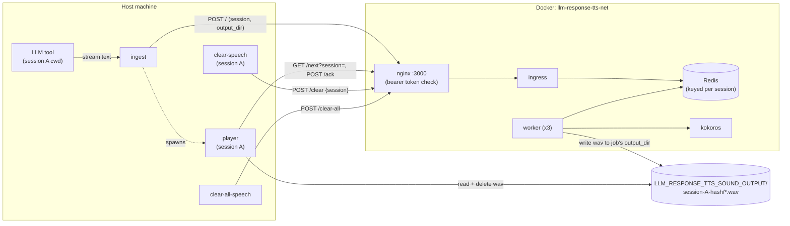
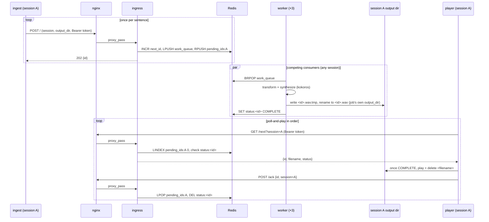

# Architecture

- `ingest` receives streamed message deltas from the hook and buffers them per `message_id`. Once the final
  delta arrives, it splits the full text into sentences (on `.`/`!`/`?`/`:`, only when followed by
  whitespace or end of text, so decimals and no-space abbreviations stay intact) and POSTs each one
  separately to nginx (`127.0.0.1:3000`, with the bearer token), which forwards it to the `ingress` service
  - so a long message becomes several small jobs instead of one big one. It also dedupes on that session's
  own `ingest-last-message.txt` so the same message isn't spoken twice. Each POST also carries the calling
  session's hash and output directory (see "Session isolation" below).
- `ingress` assigns each sentence its own monotonically increasing id (via Redis `INCR`, shared globally
  across all sessions - see "Session isolation" for why a global counter is fine) and pushes it onto a
  Redis work queue. Three `worker` containers compete for jobs off that queue in parallel, each
  transforming the text - expanding glued number+unit tokens like `24ms` or `512Mi` into spoken words
  (`services/worker/measurement-units.json`), then word references and character stripping - and
  synthesizing it via kokoros's OpenAI-compatible `/v1/audio/speech` API, then writing the result to
  `<id>.wav` in that job's own session output directory. Splitting by sentence is what lets one long message
  actually use all 3 workers concurrently, rather than one worker synthesizing the whole thing serially.
- The first `ingest` invocation for a given session to see that session's lock free spawns `player` in the
  background, which plays that session's wav files back in strict id order - never whichever one finishes
  synthesizing first - and exits after 10s of nothing left to play.
- Synthesis is entirely local - kokoros runs the Kokoro-82M model in-container and doesn't make any
  outbound network calls, so no audio or text leaves the machine. Redis, `ingress`, and the `worker`
  containers are all internal-only too (no host-published ports), same as kokoros always was.

## Session isolation

Every calling session (in practice, every distinct project `cwd` the hook fires from) gets its own
queue, output directory, and `player` process, so multiple sessions open at once never mix up each other's
wav files or playback order. `ingest` and `player` each derive a `session-hash` from `cwd` - a 32-bit
MurmurHash3 of the absolute path, base62-encoded to a fixed 6 characters - deterministically and without any
coordination between them, since both are computing the same hash from the same input. That hash prefixes a
human-readable directory name (`<hash>-<cwd-last-component>`, e.g. `2wfFFn-llm-response-tts`), used for both
the output subdirectory under `LLM_RESPONSE_TTS_SOUND_OUTPUT` and the lock directory under
`/tmp/llm-response-tts`. Every Redis key that needs to stay independent per session (`pending_ids`, the
epoch counter, and the set of known session hashes) is suffixed with the bare hash. The one exception is
`next_id`, the global monotonic id counter - it stays shared across all sessions on purpose, since ids only
need to increase, not be contiguous or session-scoped, and a shared counter is simpler than one per session
for no behavioral benefit.

## Message queueing

An LLM tool can emit several messages back-to-back - sometimes overlapping in time - and each one triggers
its own `ingest` invocation, which itself splits into multiple sentence-level jobs (see above). Either way,
synthesis happens across 3 parallel workers, so a later sentence - from the same message or a different one
- can easily finish before an earlier one; playback still has to happen in the order the text was actually
generated, so ordering can no longer be inferred from "whichever wav file shows up first."

The id `ingress` assigns via Redis `INCR` is the fix: each sentence gets one assigned once, atomically, at
the moment it's accepted, before any parallel processing happens, so it reflects true generation order
regardless of which worker later picks up the job or how long synthesis takes. That same id is also
pushed onto a per-session Redis list, `llm-response-tts:pending_ids:<session-hash>`, purely to track that
session's playback order - separate from `llm-response-tts:work_queue`, which is shared across all sessions
and is what the workers pull jobs from.

Ordering state lives entirely in Redis, not in a local file. `player` doesn't track "the next id" on disk
at all; it just asks `ingress` - `GET /next?session=<session-hash>` peeks the front of that session's
`pending_ids` list and returns `{"id", "filename", "status"}`, where `status` is `PROCESSING` or `COMPLETE`
depending on whether a worker has finished writing that id's wav yet (workers report completion into Redis
right after they write the file). `player` polls that endpoint every couple seconds; once it sees
`COMPLETE`, it plays the file from its session's output directory via `rodio`, deletes it, and calls
`POST /ack` (also carrying `session`) to pop that id off `pending_ids` before moving to the next one. If an
id stays `PROCESSING` for more than 45 seconds (long enough to cover normal CPU-bound synthesis time, since
Docker on macOS has no GPU passthrough - a worker that's actually crashed mid-job needs this much slack
too), it gives up, acks it anyway, and moves on - so one dead job can't stall everything behind it. With
nothing pending at all for 10 seconds, `player` exits.

Keeping this state server-side instead of in a local watermark file removes a whole category of bugs: a
local file can drift from what Redis actually has queued (e.g. if `/tmp` gets wiped while Redis keeps
counting, or Redis restarts while the local file doesn't) - `pending_ids` can't drift from itself.

Only one `player` may run per session, enforced with `mkdir /tmp/llm-response-tts/lock/<session-dir>.lock`
(see "Session isolation" above): `mkdir` is atomic at the filesystem level, so if two `ingest` invocations
for the same session race to create it, exactly one spawns that session's player; the rest just enqueue
their message and trust the already-running player to reach it in order. A different session's lock lives
under a different directory entirely, so sessions never contend with each other for it.

To stop everything queued for the current session (e.g. the LLM said something long and you don't want to
hear the rest), run `llm-response-tts-clear-speech`. It calls `ingress`'s `POST /clear {session}`, which
empties that session's `pending_ids` list - so its `player` sees nothing pending on its next poll - and
bumps that session's epoch counter in Redis so any job a worker already popped and is mid-synthesis for
this session gets silently discarded instead of writing a wav nobody will ever ask for; other sessions'
queued jobs are untouched. `llm-response-tts-clear-all-speech` is the blunter version: it calls
`POST /clear-all`, which does the same for every known session at once (draining the shared `work_queue`
too), for when you want silence across the board rather than just your current project. Neither command
interrupts whatever's playing on the host right now, only what would've come after it; `player` blocks
until playback finishes before its next poll, so cutting off mid-sentence would need a different design.
